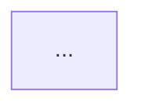

# Repo cleanup

A runbook for turning this working repo into one that reads as a deliberately authored
project. Three goals, in priority order:

1. **No build artifacts or local state in the tree** — nothing that a fresh clone plus
   `docker compose up` wouldn't regenerate.
2. **No trace of the assistant or the spec it was built against** — not in filenames, not
   in git history, not in 34 source-comment citations, not in the prose voice.
3. **A README with exactly six sections**, everything else demoted to `docs/`.

Work top to bottom — step 2 (history) is much easier before you add new commits, and step 6
(README) is easier once the docs it will point at exist.

**Do not touch:** `tests/fixtures/` (recorded API responses — they're the reason the test
suite never hits Steam), `dbt/seeds/` (real resolved data), the contact address in
`.env.example` (deliberate scraping etiquette, not a leak), or the *substance* of the
honest-gaps content in `docs/` — that's the project's strongest feature. Only its voice
changes.

---

## 0. Baseline

Branch, and record a known-good state so you can tell whether a comment edit broke
something it shouldn't have.

```bash
git checkout -b cleanup
uv run pytest -q                 # expect 81 passed
uv run mypy ingest               # expect 0 errors
cd dbt && dbt compile && cd ..   # expect 14 models compiled
```

---

## 1. Delete what shouldn't be in the tree

| Path | Size / count | Tracked by git? | Why it goes |
|---|---|---|---|
| `CLAUDE_4.md` | 27 KB | **yes** | The build spec. The only genuinely tracked offender. |
| `.claude/` | empty | no | Assistant runtime state directory. |
| `.mypy_cache/`, `.pytest_cache/` | — | no | Tool caches. |
| `dbt/target/` | ~50 files | no | Compiled dbt output; regenerated by `dbt compile`. |
| `dbt/logs/dbt.log` | — | no | Contains 57 spec references in logged SQL. |
| `dbt/.user.yml` | 42 B | no | dbt's anonymous-usage user id. |
| `dbt/steam_market.duckdb` | 6.0 MB | no | The warehouse itself. Rebuilt by `dbt run`. |
| `logs_bronze_writer.txt`, `logs_scheduler.txt` | 3 KB | no | Ad-hoc run transcripts. |
| `logs/alerts.jsonl` | — | no | Webhook receiver output. |
| `data/` | ~2,600 files | no | Cached JS chunks, a 5 MB bucket page, resolved bucket ids, FX rates. |

Everything except `CLAUDE_4.md` is already covered by `.gitignore` — it's local clutter,
not committed. Confirm that before deleting anything:

```bash
git ls-files | grep -iE 'claude|logs_|\.duckdb|user\.yml|target/|^data/'
# should print exactly one line: CLAUDE_4.md
```

Then:

```bash
git rm CLAUDE_4.md
rm -rf .claude .mypy_cache .pytest_cache dbt/target dbt/logs dbt/.user.yml
rm -f logs_bronze_writer.txt logs_scheduler.txt
rm -rf logs data dbt/steam_market.duckdb
```

> **Keep a copy of `data/cache/market_bucket_ids.json` somewhere outside the repo** if you
> ever want to re-export `dbt/seeds/item_bucket_map.csv`. The seed itself is committed, so
> nothing breaks — but re-resolving 612 items costs real requests against Steam.

---

## 2. Remove the spec from git history

`git log` currently shows a single commit (`dc623a2 initial commit`), and `CLAUDE_4.md` is
in it. Deleting the file in a *new* commit leaves it fully recoverable from history — which
defeats the point. Because there's only one commit, the fix is cheap:

```bash
# Option A — amend the only commit (recommended, single commit repo)
git rm --cached CLAUDE_4.md
git commit --amend --no-edit
git log --stat | grep -i claude     # must return nothing
```

If you've already pushed, this needs `git push --force`. If more commits exist by the time
you do this:

```bash
# Option B — rewrite every commit
pipx run git-filter-repo --path CLAUDE_4.md --invert-paths
```

Also check the commit messages themselves and any trailers:

```bash
git log --format='%B' | grep -iE 'claude|anthropic|co-authored'
```

---

## 3. `.gitignore`

Lines 39–40 currently read:

```
# Claude Code runtime state
.claude/
```

Replace with a neutral heading that covers editor and tool state generally:

```
# Local editor / tool state
.claude/
.vscode/
.idea/
```

Keeping the `.claude/` entry is fine and sensible — it just shouldn't be *labelled* as the
only thing that category exists for.

---

## 4. De-reference the spec in source comments

**34 lines across 21 files.** The comments themselves are the best documentation in the
repo — they explain *why* a decision was made. Only the citation is the problem. The rule:
**keep the reasoning, delete the reference, and where the reference was carrying the
justification, restate it in the project's own voice.**

Translation vocabulary:

| Current phrasing | Replace with |
|---|---|
| `per CLAUDE.md §2` | `per the rate-limit policy (README §03)` |
| `CLAUDE.md Phase 2 step 4:` | *(delete — the sentence usually stands alone)* |
| `CLAUDE.md's Phase 2 step 1 specifies X` | `The obvious API here is X` |
| `CLAUDE.md asks for it separately` | `It's a separate class on purpose` |
| `the spec's original assumption` | `the assumption going in` |
| `per the repo layout in CLAUDE_4.md §5` | `per the layer rules (README §05)` |

### The full list

| File | Line | What to do |
|---|---|---|
| `ingest/ratelimit.py` | 1 | Drop `, per CLAUDE.md §2 and §7.1.1`. The docstring's own rule list below already says everything. |
| `ingest/schemas.py` | 3 | `(CLAUDE.md §6)` → `(a rule this project applies throughout)`. |
| `ingest/fx_rates.py` | 5 | `(CLAUDE.md §3: "not from paid aggregators")` → `— this project uses primary sources, not paid aggregators`. |
| `streaming/cdc_job.py` | 1, 24, 51, 52, 63 | Five references in one docstring. Line 1: drop the parenthetical. Line 24: rewrite as "The typed `flatMapGroupsWithState` API is Scala/Java-only; PySpark has never exposed it." Lines 51–52: `CLAUDE.md's Phase 2 step 3 asks to unify…` → `The unified schema is meant to cover CS2/Dota 2/TF2/Rust/PUBG…`. Line 63: `CLAUDE.md's Phase 2 step 1 names exactly four watched fields` → `the CDC job watches exactly four fields`. |
| `streaming/money.py` | 1 | Drop `(CLAUDE.md Phase 2 step 4: …)`, keep the quoted intent as a plain statement. |
| `streaming/depth.py` | 1 | Drop `(CLAUDE.md Phase 2 step 5)`. |
| `analytics/anomaly.py` | 1, 9, 117, 162, 216 | Line 1: `"""Anomaly detection."""`. Line 9: `CLAUDE.md's defaults` → `The default windows here`. Lines 117 / 162: the quoted rationales are good — keep the quotes, drop the attribution. Line 216: as per the vocabulary table. |
| `quality/alerting.py` | 1 | `(CLAUDE.md Phase 4 step 4: "Route failures to SNS…")` → `Alerts route to a configurable local webhook; the interface is what matters for swapping in SNS/Slack/PagerDuty later.` |
| `quality/expectations/bronze_suite.py` | 1 | Drop `(CLAUDE.md Phase 4: schema drift, freshness)` → `(schema drift + freshness)`. |
| `quality/webhook_receiver.py` | 1 | Drop the citation; keep "a local webhook, staying off AWS". |
| `airflow/dags/steam_market_batch.py` | 1, 16, 133 | Line 1: `"""steam_market_batch — the orchestration DAG."""`. Line 16 and the log string at 133 both cite `§4.1` for the Snowflake deferral — replace with `Snowflake is deliberately deferred until the soak test and unattended-DAG gaps close (docs/DECISIONS.md).` **Line 133 is a runtime log message**, so keep it a complete, readable sentence. |
| `dbt/models/intermediate/int_orderbook_normalized.sql` | 1 | Drop `(CLAUDE.md Phase 2/3: …)`, keep the measure list. |
| `dbt/models/marts/mart_item_daily.sql` | 1 | Drop `(CLAUDE.md Phase 3)`. |
| `dbt/models/marts/mart_cross_currency_dislocation.sql` | 1 | `Phase 6 (CLAUDE.md, "optional, high value")` → `Cross-currency dislocation:`. |
| `dbt/models/staging/stg_orderbook.sql` | 7 | `per the repo layout in CLAUDE_4.md §5` → `per the layer rules (README §05)`. |
| `dbt/snapshots/dim_item_snapshot.sql` | 2 | Drop `(CLAUDE.md Phase 3: …)`, keep the SCD2 description. |
| `dbt/tests/assert_crossed_book_rare.sql` | 3 | Keep the quoted definition of the check, drop `(CLAUDE.md Phase 4)`. Same for the five files below. |
| `dbt/tests/assert_price_plausibility.sql` | 3 | ↑ |
| `dbt/tests/assert_volume_monotonicity.sql` | 3 | ↑ |
| `dbt/tests/assert_no_duplicate_grain_fct_price_observation.sql` | 1 | ↑ |
| `dbt/tests/assert_no_duplicate_grain_fct_orderbook_snapshot.sql` | 1 | ↑ |
| `dbt/tests/assert_referential_integrity_fct_price_observation.sql` | 1 | ↑ |
| `scripts/phase0_recon.py` | 4 | `every endpoint in CLAUDE_4.md §3` → `every endpoint in scope`. |
| `scripts/phase0_ratelimit.py` | 8 | `Per CLAUDE_4.md §2.3/§2.5:` → `Rules this respects:`. |

Three of these — `assert_price_plausibility.sql`, `assert_volume_monotonicity.sql`,
`assert_crossed_book_rare.sql` — carry a real measured number as the justification for
`severity='warn'`. Preserve that. It's the reason those files are convincing.

Do **not** try to do this with `sed`. The replacements aren't mechanical and several are
mid-sentence.

---

## 5. Rewrite `docs/`

### `docs/DECISIONS.md` — 17 references, and the voice problem

The most valuable file in the repo. Two passes:

**Pass A — spec citations.** Same rule as §4. `CLAUDE.md Phase 7.1 asks for the 3 slowest
analytical queries…` becomes `The goal for this phase: profile the 3 slowest analytical
queries…`. Every entry's **Context / What we found / Decision / Alternative considered**
structure stays exactly as it is — that's ADR form, and it's correct.

**Pass B — session voice.** The phrase *"this session"* appears 42 times across `docs/`.
It's the single clearest tell that this was written during one sitting rather than authored.

| Current | Replace with |
|---|---|
| "this session's dataset" | "the current dataset" / "the dataset as it stands" |
| "built in a single working session" | "built over a short, concentrated build" |
| "no browser was available this session" | "no browser automation was available" |
| "found and fixed this session" | "found and fixed" *(the date stamp already says when)* |
| "the remaining 45 items are queued to resume" | past tense — it did resume |

Also trim, but don't remove, the meta-commentary: *"stated plainly, not hidden"*, *"rather
than faked"*, *"not a rubber-stamped exit"*. The honesty is the point; announcing the
honesty three times per section is what reads as generated. **Keep one per document, not
one per paragraph.**

### `docs/METRICS.md` — 3 references

The opening line cites the spec's honesty rule. Make it the project's own:

> Every number here is measured, with the method that produced it. Unmeasured numbers are
> recorded as `TBD`, never estimated.

Everything else — the per-phase tables and the "Not yet measured" blocks — stays verbatim.
Those blocks are load-bearing.

### `docs/PHASE0_FINDINGS.md` — 3 references

The summary table's first column header is *"Assumption in the spec"*. Change to
*"Assumption going in"*. Two `CLAUDE_4.md` mentions in §3.7 and the exit-criteria checklist
become "the currency table below" and "corrected above".

### `docs/PHASE4_DAG_SUCCESS_EVIDENCE.txt` / `_GATE_FAILURE_EVIDENCE_dbt.txt`

Each has one reference — **both in the human-written header, not in the log body**. Edit the
header prose only.

> **Do not edit a single character below the header.** Those are captured terminal
> transcripts. Their entire evidential value is that they weren't touched. If a log line
> contains something you don't want to publish, delete the whole file rather than edit it.

### New: `docs/RUNBOOK.md`

Create this to receive what leaves the README (see §6): the full command sequence for a cold
start, the dbt run order and why it's ordered that way, service URLs and ports, and the
config values worth knowing from `.env.example`.

### Optional: rename the phase-numbered docs

`PHASE0_FINDINGS.md`, `PHASE4_GATE_FAILURE_EVIDENCE.txt` etc. read as build-process
artifacts. `docs/api-recon.md`, `docs/evidence/quality-gates-blocking.txt` read as project
documentation. This is cosmetic and cheap to skip — but if you do it, grep for the old names
first, they're cross-referenced from `README.md`, `DECISIONS.md`, `METRICS.md`, and several
module docstrings.

---

## 6. The new README — six sections, nothing else

Current structure is roughly ten unnumbered sections mixing architecture, metrics,
retrospection, and run instructions. Replace with exactly this:

| § | Heading | Content | Sourced from |
|---|---|---|---|
| 01 | What this is | The four questions the warehouse answers, each mapped to its table. One paragraph on the order-book endpoint rediscovery — it's the differentiator, so it goes above the fold. | Current README intro |
| 02 | Architecture | The mermaid flowchart, plus the two honest framing paragraphs: *why Kafka at this volume* and *CDC over periodic snapshots, not true event streaming*. | Current README "Architecture" |
| 03 | Data sources | The six-endpoint status table (live / rediscovered / dead / out of scope), the corrected currency codes, and the rate-limit policy: 0.5 req/s, 429 handling, circuit breaker, cache-everything. | `docs/PHASE0_FINDINGS.md` |
| 04 | Tech stack | Layer → tool → why → where. Include the two rejections that carry reasoning: Postgres-for-Grafana over an unsigned DuckDB plugin, and DuckDB over Snowflake. | New; assembled from `docker-compose.yml` + `pyproject.toml` |
| 05 | Data model | The dbt lineage diagram, the three layer rules (staging = views/light typing, intermediate = identity + derived, marts = tables), and the mart-grain table. Note the deliberate Python/SQL duplication of money and depth math. | Current README lineage + `dbt/` |
| 06 | Repo structure | The directory tree with a one-line purpose per directory, then a short table per top-level package. End with a pointer to `docs/`. | Current README "Repo layout", expanded |

### Skeleton

````markdown
# Steam Market Intelligence Pipeline

One-paragraph statement of what it is and what it produces.

- [01 · What this is](#01--what-this-is)
- [02 · Architecture](#02--architecture)
- [03 · Data sources](#03--data-sources)
- [04 · Tech stack](#04--tech-stack)
- [05 · Data model](#05--data-model)
- [06 · Repo structure](#06--repo-structure)

## 01 · What this is
...

## 02 · Architecture


## 03 · Data sources
| Endpoint | Role | Status | What was found |

## 04 · Tech stack
| Layer | Tool | Why | Where |

## 05 · Data model


## 06 · Repo structure
```
ingest/    ...
```
Measured results live in [docs/METRICS.md](docs/METRICS.md), the decision log in
[docs/DECISIONS.md](docs/DECISIONS.md), and setup in [docs/RUNBOOK.md](docs/RUNBOOK.md).
````

### What leaves the README, and where it goes

| Leaving | New home |
|---|---|
| "Headline metrics" table | `docs/METRICS.md` (already there — the README was duplicating it) |
| "Quality gate, demonstrated failing" | `docs/DECISIONS.md` Phase 4 entry + the evidence files |
| "Known gaps" | `docs/METRICS.md`, as a single **Status and open gaps** section at the top |
| "What I'd do differently at scale" | `docs/DECISIONS.md`, as a closing **Retrospective** entry |
| "Running it" + "Dashboard" | `docs/RUNBOOK.md` |
| dbt lineage caveat about no screenshots | delete — with the diagram present, the apology is noise |

Nothing is deleted except that last row. The README stops being the place all of it lives.

---

## 7. Language pass

Beyond `"this session"`, three habits to break across README and `docs/`:

1. **Announcing honesty instead of being honest.** "stated plainly", "not faked", "rather
   than hidden", "honest", "genuinely" — the content is already honest. Keep at most one
   such phrase per document, in the opening statement of intent.
2. **Second-guessing in the prose.** "worth saying plainly rather than pretending", "not a
   rubber-stamped exit", "recorded honestly rather than dressed up". Cut the clause, keep
   the fact.
3. **Bold-lead sentences everywhere.** `**Bug #1 (found before it produced wrong output):**`
   is good once. In `DECISIONS.md` it's the shape of nearly every paragraph. Vary it.

Read the first 20 lines of `README.md` and the newest `DECISIONS.md` entry out loud. If it
sounds like a report *about* doing the work rather than documentation *of* the work, that's
the thing to fix.

---

## 8. Verify

```bash
# 1 — no references anywhere, tracked or not
grep -rniI --exclude-dir=.git --exclude-dir=.venv -e claude -e anthropic .
# expected: no output

# 2 — nothing in history
git log --all --format='%B' | grep -iE 'claude|anthropic'
git log --all --stat | grep -i claude
# expected: no output for both

# 3 — nothing broke
uv run pytest -q                 # 81 passed
uv run mypy ingest               # 0 errors
cd dbt && dbt compile && cd ..   # 14 models

# 4 — tree is clean
git status --porcelain           # only your intended changes
du -sh .                         # no multi-MB surprises
git ls-files | wc -l             # ~102 after removing the spec
```

Then commit:

```bash
git add -A
git commit -m "Restructure README, move detail into docs/, remove build artifacts"
```

## 9. Delete this file

```bash
rm CLEANUP.md
```
