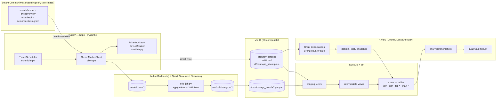
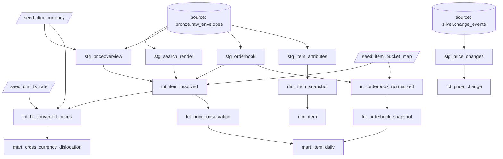

# Steam Market Intelligence Pipeline

A streaming data platform built over the Steam Community Market's real (undocumented)
API, from a single well-behaved IP, with no third-party aggregators involved. It ingests
market data, streams change-data-capture events through Kafka/Spark, lands a
Bronze/Silver/Gold warehouse in DuckDB via dbt, orchestrates the whole thing with
Airflow behind blocking data-quality gates, and runs anomaly detection and a
cross-currency pricing analysis on top.

This project follows one non-negotiable rule throughout: **every number in this README
and in `docs/METRICS.md` is measured, dated, and traceable to a command or a saved log —
never estimated.** Where something wasn't measured, it says so, in the same place a real
number would go. `docs/DECISIONS.md` has the full ADR-style log, including every real bug
found, how it was diagnosed, and what was rejected along the way.

---

## Architecture



**Why Kafka for this volume?** Honestly, mostly decoupling and replay, not throughput —
this volume (single IP, sub-1 req/s) doesn't need Kafka's scale. The real justification:
consumer independence (Bronze writer and the Spark CDC job both read `market.raw.v1`
independently, at their own pace, without coordinating with the poller), and replay
(Bronze can be rebuilt from the topic without re-hitting Steam). At this data volume,
that's somewhat over-engineered for the throughput alone — worth saying plainly rather
than pretending it was throughput-driven.

**Is this actually streaming, or a cron job with extra steps?** The *source* is
poll-based — Steam has no push/webhook mechanism, so there's no way around periodic
snapshots at the ingestion edge. What's real streaming is everything downstream of that:
Kafka decouples producer/consumer, and `cdc_job.py` treats each snapshot as an event in a
Spark Structured Streaming job with `applyInPandasWithState`, diffing against
per-key state rather than batch-diffing whole tables. The honest name for this pattern is
"CDC over periodic snapshots," not "true event streaming" — Phase 2 in `docs/DECISIONS.md`
covers this in more depth (`Change events emitted` in `docs/METRICS.md` Phase 2).

## dbt lineage (real `ref()` graph, not a rendered screenshot)

No browser was available in this environment to capture an actual `dbt docs generate` /
`dbt docs serve` screenshot — stated plainly rather than faked. This diagram is generated
directly from the real `ref()`/`source()` calls in every model file (see the graph
extraction in this README's own history if you want to regenerate it: `grep -oE
"ref\('[a-zA-Z0-9_]+'\)"` across `dbt/models/**/*.sql`), so it's accurate to the actual
project, just not a pixel-for-pixel UI capture.



## Quality gate, demonstrated failing (real evidence, not a description of intent)

CLAUDE.md's Phase 4 exit criterion required *proving* the blocking gates actually block,
with saved evidence — not just building them and trusting they would. Both gate layers
were tested against deliberately injected bad data. Full saved output:
`docs/PHASE4_GATE_FAILURE_EVIDENCE.txt` (Great Expectations, 3 injected failure modes) and
`docs/PHASE4_GATE_FAILURE_EVIDENCE_dbt.txt` (a real dbt test, real exit code 1). Excerpt:

```
=== Test 3: null app_id injected ===
Bronze quality gate FAILED: 14/15 expectations passed (freshness SLA=25.0h).
Failed expectations: ['expect_column_values_to_not_be_null']
success: False | failed: ['expect_column_values_to_not_be_null']
```

```
1 of 1 START test assert_no_duplicate_grain_fct_price_observation .............. [RUN]
1 of 1 FAIL 1 assert_no_duplicate_grain_fct_price_observation .................. [FAIL 1 in 0.03s]
...
Completed with 1 error, 0 partial successes, and 0 warnings
```

Both times, the corrupted state was restored (`dbt run`) immediately after capturing the
failure — this repo's warehouse reflects real, uncorrupted data.

## Headline metrics

Full detail with methodology for every number: [`docs/METRICS.md`](docs/METRICS.md).

| | |
|---|---|
| Measured rate-limit break point | ~2 req/s; production rate set to 0.5 req/s (25% margin) |
| Circuit breaker | Tripped for real once, under real sustained load (Phase 6) — halted correctly, was not evaded |
| Real bugs found and fixed across the project | 3 separate "money-domain" mixing bugs (CDC, OHLC, FX join) + 1 dbt CSV NULL-parsing bug + 1 NULL-join correctness bug (Phase 7) + 5 Airflow/dbt-CLI mechanics bugs |
| dbt models | 14 (7 staging/intermediate views, 7 mart/fact/snapshot) |
| dbt tests | 26 (23 pass, 3 `severity=warn` by design, 0 error) |
| Full pytest suite | 81/81 passing |
| `mypy --strict` on `ingest/` | 0 errors |
| Airflow DAG | 11/11 tasks succeeded on a real, on-demand run against real data |
| Anomaly detection | 25 hand-verified `crossed_book` anomalies (3/3 spot-checked against raw Bronze JSON, 0 false positives in that sample); z-score/spread/volume detectors mechanically correct but never fired — this session's dataset doesn't span enough calendar time |
| Cross-currency FX analysis (n=50 items) | No persistent structural pricing gap found — apparent gaps track item price (rounding noise), not currency, once the full sample is measured |
| Query tuning (Phase 7) | Materialized-table vs. view: ~196× faster; window function vs. correlated subquery: ~43% faster; self-join vs. `QUALIFY`: found and fixed a real correctness bug (`NULL = NULL`) |

## Known gaps — stated plainly, not hidden

This was built in a single working session, not over 30 days. Per this project's own
honesty rule, these are the exit criteria that are **not** met, and why:

- **Phase 1's 24h zero-429 soak test never ran.** Everything downstream that would
  benefit from continuous steady-cadence data (CDC compression ratio, anomaly detector
  hit rates, Bronze partition growth) is measured against a short, disconnected ad-hoc
  session instead, and flagged as such wherever it appears in `docs/METRICS.md`.
- **Airflow's DAG was never run unattended on a schedule for 72h** — `airflow-scheduler`
  was never started as a persistent service; the DAG was proven correct via `airflow dags
  test` against real data instead.
- **Snowflake was never opened.** Deliberately deferred (see `docs/DECISIONS.md`, Phase
  3) pending the two gaps above — DuckDB was used for the whole warehouse layer instead,
  which is also why Phase 7's query tuning used `EXPLAIN ANALYZE` instead of Snowflake
  query profiles, and why "add a clustering key" isn't in this project's fix list (DuckDB
  has no clustering-key equivalent).
- **No dbt-docs / Airflow-UI screenshots** — no browser was available in this
  environment. Where the spec asked for a screenshot, this README either quotes the real
  terminal evidence directly or generates an equivalent diagram from the real source
  files, and says so rather than presenting a description as if it were an image.

## What I'd do differently at scale

- **Materialize more aggressively, sooner.** Phase 7's single most dramatic measured
  result wasn't a clever join rewrite — it was the ~196× gap between a view stacked on
  live S3 reads and a materialized table. At real production volume, every intermediate
  model that gets queried more than once during a batch run should probably be a table,
  not a view; this project's `+materialized: view` default for staging/intermediate was
  the right call for iteration speed while this was actively being built, and the wrong
  call for a production query path.
- **A real per-request-identity rate limit, not a global one.** The current design uses
  one global token bucket shared across all tiers (per `docs/DECISIONS.md`, deliberately,
  to avoid Tier A + Tier B/C jointly exceeding the measured limit even if each
  individually respects it). That's correct for a single IP, but doesn't extend cleanly
  to a multi-worker or multi-IP setup — a distributed rate limiter (e.g., Redis-backed
  token bucket) would be the real fix, not something this project needed to build for a
  single-IP scope.
- **Idempotent, replayable CDC state**, not just crash-safe writers. `bronze_writer.py`
  and `silver_writer.py` are already crash-safe (`enable_auto_commit=False`, commit after
  flush — a real bug caught and fixed this session), but `cdc_job.py`'s per-key state
  store is in-memory for this project's scope. At real scale, that state needs to survive
  a Spark job restart without reprocessing the entire topic from the beginning —
  Structured Streaming's checkpointing does this, but it wasn't exercised end-to-end here
  (no long-running restart was ever tested).
- **A currency/domain type, not a string convention.** The money-domain bug (found and
  fixed three separate times — CDC, OHLC, the FX join — before it stopped recurring) is
  the clearest single lesson from this project: an implicit invariant ("never compare
  prices across currencies") that isn't enforced by the type system will eventually get
  violated by a new code path that doesn't know about the convention. At scale, this
  should be a real type (a `Money` value object carrying its currency, refusing to
  compare/add across currencies at the language level) rather than a `money_domain`
  string that every new query has to remember to filter on — Phase 7's Q3 finding (a
  `NULL`-currency equi-join silently dropping rows) is the same root cause wearing a
  different SQL-semantics mask.
- **Multi-IP / longer time horizon before trusting a single rate-limit measurement.**
  Phase 0's single ramp-test measurement (~2 req/s break point) turned out not to be
  fully representative — the circuit breaker tripped for real in Phase 6 under a longer,
  denser burst at a rate that had been running safely for hours elsewhere in the project.
  At real scale this argues for continuous adaptive rate-limiting (back off automatically
  based on live 429 rate, not a single historical measurement) rather than one static
  configured number, however conservatively chosen.

## Repo layout

```
ingest/           HTTP client, rate limiter + circuit breaker, endpoint parsers, scheduler
streaming/        Spark CDC job, money/depth math, Bronze + Silver Kafka writers
dbt/              seeds, staging/intermediate/marts, snapshots, singular tests
analytics/        anomaly detection (z-score, EWMA spread, volume-spike, crossed-book)
quality/          Great Expectations Bronze suite, alerting, webhook receiver
airflow/dags/     the orchestration DAG
scripts/          one-off phase scripts (recon, soak tests, FX watchlist poll, query tuning)
tests/            pytest suite — unit + fixture-based, never hits the live Steam API
docs/             DECISIONS.md (full ADR log), METRICS.md (every measured number)
```

## Running it

```bash
docker compose up -d
docker exec steam-redpanda rpk topic create market.raw.v1 market.changes.v1

uv run python -m ingest.scheduler          # poller -> Kafka
uv run python -m streaming.bronze_writer   # Kafka -> Bronze (Parquet on MinIO)
# Spark CDC job runs inside the spark container — see docs/DECISIONS.md for the spark-submit invocation

cd dbt && dbt seed && dbt run && dbt snapshot && dbt test
uv run python -m analytics.anomaly
```

Full test suite: `uv run pytest -q`. Type checking: `uv run mypy ingest` (strict) and
`uv run mypy streaming analytics --ignore-missing-imports`.

---

Built against Steam's real Community Market API directly — no paid aggregators
(Capitol-Trades-style repackagers) involved, per this project's own scraping-etiquette
rule: cache everything, rate-limit conservatively, respect a real circuit breaker, never
commit scraped data (`data/` is gitignored throughout).
