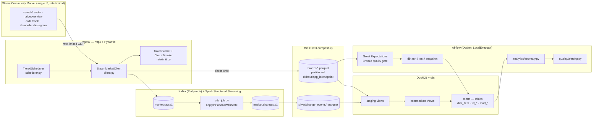
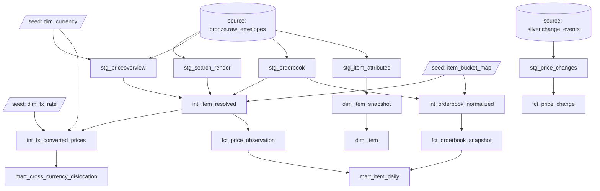

# Steam Market Intelligence Pipeline

A streaming data platform built over the Steam Community Market's real (undocumented) API,
from a single well-behaved IP, with no third-party aggregators involved. It ingests market
data, streams change-data-capture events through Kafka/Spark, lands a Bronze/Silver/Gold
warehouse in DuckDB via dbt, orchestrates the whole thing with Airflow behind blocking
data-quality gates, and runs anomaly detection and a cross-currency pricing analysis on
top.

Every number in this README and in [`docs/METRICS.md`](docs/METRICS.md) is measured,
dated, and traceable to a command or a saved log — never estimated. Where something wasn't
measured, it says so, in the same place a real number would go.

- [01 · What this is](#01--what-this-is)
- [02 · Architecture](#02--architecture)
- [03 · Data sources](#03--data-sources)
- [04 · Tech stack](#04--tech-stack)
- [05 · Data model](#05--data-model)
- [06 · Repo structure](#06--repo-structure)

## 01 · What this is

The warehouse exists to answer four questions about the Steam Community Market, each
backed by its own table:

| Question | Answered by |
|---|---|
| What's the current price and spread for an item? | `mart_item_daily`, `fct_orderbook_snapshot` |
| How has an item's price moved, and does it look anomalous? | `fct_price_change`, `mart_anomaly` |
| Is the order book internally consistent (crossed, thin, deep)? | `fct_orderbook_snapshot` |
| Does the same item price differently once currency is controlled for? | `mart_cross_currency_dislocation` |

The order-book endpoint is the project's differentiator. The documented resolution path
(`item_nameid` scraped out of an item's listing page) is dead — Valve's SPA now redirects
every listing page into a bucket view with none of the old markers present. Rather than
guess at a replacement, the SPA's own code-split JS chunks were downloaded and read
statically, which surfaced the real mechanism: a small query-action RPC
(`/market/orderbook?q=Load&qp=[app_id, market_bucket_id]`) keyed by a `market_bucket_id`
that's free to obtain for commodity items (already present in `search/render` results) and
costs one request per item family for wear-variant skins (embedded in the bucket page's
inline JSON). See [`docs/DECISIONS.md`](docs/DECISIONS.md) ("Order-book resolution") for
the full trace.

## 02 · Architecture



**Why Kafka for this volume?** Mostly decoupling and replay, not throughput — at a single
IP polling sub-1 req/s, Kafka's scale headroom goes unused. The real justification:
consumer independence (the Bronze writer and the Spark CDC job both read `market.raw.v1`
independently, at their own pace, without coordinating with the poller), and replay (Bronze
can be rebuilt from the topic without re-hitting Steam). At this data volume that's
over-engineered for throughput alone, which is worth being upfront about.

**Is this actually streaming, or a cron job with extra steps?** The *source* is poll-based
— Steam has no push/webhook mechanism, so there's no way around periodic snapshots at the
ingestion edge. What's real streaming is everything downstream of that: Kafka decouples
producer/consumer, and `cdc_job.py` treats each snapshot as an event in a Spark Structured
Streaming job with `applyInPandasWithState`, diffing against per-key state rather than
batch-diffing whole tables. The accurate name for this pattern is "CDC over periodic
snapshots," not "true event streaming" — see `docs/DECISIONS.md` ("Streaming / CDC") and
the `Change events emitted` row in `docs/METRICS.md`.

## 03 · Data sources

| Endpoint | Role | Status | What was found |
|---|---|---|---|
| `search/render` | Catalog breadth sweep | Live | Page size is hard-capped at 10 items/request regardless of the requested `count` — a full CS2 sweep is ~3,535 requests, not the ~354 originally assumed. |
| `priceoverview` | Point price (lowest/median/volume) | Live | Matches expected shape. Prices are locale-formatted strings (`$`, `£`, `¥`, `Rp`, etc.) requiring currency-aware parsing. |
| `orderbook` (`?q=Load&qp=[...]`) | Order-book depth | Rediscovered | The documented `itemordershistogram` path is dead; this RPC, traced from the SPA's own JS bundles, replaces it entirely. See §01. |
| `itemordershistogram` | Order-book depth (legacy) | Dead | `item_nameid` resolution (scraped from listing-page HTML) no longer works — every listing page now redirects into a bucket view with no `item_nameid` present anywhere. |
| `itemordersactivity` | Order-book activity feed | Out of scope | Not exercised — no modern replacement was found during the `orderbook` investigation, and it's optional in scope either way. |
| `pricehistory` | Historical price series | Out of scope | Requires an authenticated session (HTTP 400 without one); logging in is out of scope for this project. |

**Currency codes**, cross-checked against real price-string formatting rather than assumed:
`10` → IDR, `13` → SGD (two codes that are commonly assumed to be reversed). `1`/`2`/`3`
(USD/GBP/EUR) confirmed correct. Full table in `docs/FINDINGS.md`.

**Rate-limit policy:** measured break point is ~2 req/s sustained (first 429 at request
#21 in a ramped test); production rate is set to **0.5 req/s**, one global token bucket
shared across all polling tiers so no tier can individually stay compliant while the sum
exceeds the measured limit. A circuit breaker halts all traffic on sustained 429s and has
tripped for real once, under real load, recovering correctly. Every fetched page/PDF is
cached locally and never re-fetched for the same filing/observation. Full methodology:
`docs/FINDINGS.md`.

## 04 · Tech stack

| Layer | Tool | Why | Where |
|---|---|---|---|
| Ingestion | `httpx` + Pydantic | Typed, async-friendly HTTP client with schema validation on every response | `ingest/` |
| Streaming transport | Kafka (Redpanda) | Decouples producer/consumer and enables replay without re-hitting Steam — see §02 | `docker-compose.yml`, `ingest/kafka_producer.py` |
| Stream processing | Spark Structured Streaming | `applyInPandasWithState` gives per-key CDC state without hand-rolling a state store | `streaming/cdc_job.py` |
| Lake storage | MinIO (S3-compatible) | Local, zero-cost S3 semantics for Bronze/Silver Parquet | `docker-compose.yml` |
| Warehouse | DuckDB + dbt | See rejection below (vs. Snowflake) | `dbt/` |
| Orchestration | Airflow (Docker, LocalExecutor) | Blocking quality gates between layers, a real scheduler UI, industry-standard DAG semantics | `airflow/dags/` |
| Data quality | Great Expectations (Bronze) + dbt tests (modeled layers) | GX suits raw-layer schema/freshness checks; dbt's own test framework is the natural fit once data is modeled — avoids duplicate-logic drift between the two | `quality/expectations/`, `dbt/tests/` |
| Testing | pytest + `mypy --strict` | Fixture-based, never hits the live Steam API | `tests/` |

**Rejected: Snowflake.** Deliberately deferred — see `docs/DECISIONS.md` ("Warehouse") —
pending a 24h unattended soak test and a 72h unattended-DAG run, neither of which has
happened yet. DuckDB carries the whole warehouse layer instead, which is also why query
tuning (`docs/METRICS.md`) used `EXPLAIN ANALYZE` rather than Snowflake query profiles,
and why "add a clustering key" isn't in this project's fix list — DuckDB tables aren't
micro-partitioned the way Snowflake's are, so that fix category doesn't transfer.

## 05 · Data model



Generated directly from the real `ref()`/`source()` calls in every model file, so it's
accurate to the actual project rather than a point-in-time screenshot.

**Layer rules**, enforced by convention and by `dbt_project.yml`'s materialization config:

| Layer | Materialization | Responsibility |
|---|---|---|
| `staging/` | View | 1:1 with a Bronze/Silver source, light typing/renaming only — no joins, no business logic |
| `intermediate/` | View | Identity resolution and derived fields (money parsing, spread/depth math, FX conversion) — the layer where cross-endpoint joins happen |
| `marts/` | Table | Final, queried-by-consumers grain — materialized for the ~196× read-speed difference measured in `docs/METRICS.md` |

**Mart grain:**

| Table | Grain |
|---|---|
| `dim_item` | One current row per item (SCD Type 2 on attribute change) |
| `fct_price_observation` | One row per raw price observation (any endpoint) |
| `fct_orderbook_snapshot` | One row per order-book poll |
| `fct_price_change` | One row per detected CDC change event |
| `mart_item_daily` | item × day × `money_domain` (OHLC + time-weighted spread) |
| `mart_cross_currency_dislocation` | One row per non-USD observation, ASOF-joined to its nearest-prior USD baseline |
| `mart_anomaly` | One row per detected anomaly — written directly by `analytics/anomaly.py`, not a dbt model |

**Money and depth math are deliberately implemented twice** — once in Python
(`streaming/money.py`, `streaming/depth.py`) for the streaming path, once in SQL
(`dbt/macros/parse_price.sql`, `int_orderbook_normalized.sql`) for the batch path. This is
normal medallion-architecture duplication, not an oversight: streaming and dbt are
independent consumers of the same Bronze data with different freshness/latency needs. The
tradeoff is real, though — the same class of bug (mixing incompatible currencies together,
the recurring "money-domain" bug documented in `docs/DECISIONS.md`) had to be found and
fixed independently on both sides.

## 06 · Repo structure

```
ingest/           HTTP client, rate limiter + circuit breaker, endpoint parsers, scheduler
streaming/        Spark CDC job, money/depth math, Bronze + Silver Kafka writers
dbt/              seeds, staging/intermediate/marts, snapshots, singular tests
analytics/        anomaly detection (z-score, EWMA spread, volume-spike, crossed-book)
quality/          Great Expectations Bronze suite, alerting, webhook receiver
airflow/dags/     the orchestration DAG
scripts/          one-off recon/calibration scripts (recon, rate-limit probe, smoke test,
                  FX watchlist poll, query tuning)
tests/            pytest suite — unit + fixture-based, never hits the live Steam API
docs/             decision log, measured metrics, data-source findings, and the setup
                  runbook
```

| `ingest/` | Purpose |
|---|---|
| `client.py` | `SteamMarketClient` — the single HTTP entry point, wraps rate limiting and response validation |
| `ratelimit.py` | Token-bucket rate limiter + circuit breaker |
| `scheduler.py` | `TieredScheduler` — tiered polling cadence across endpoints |
| `nameid_resolver.py` | Resolves `market_bucket_id` for commodity and wear-variant items (see §01) |
| `fx_rates.py` | Daily FX rates from Frankfurter (ECB-sourced, free, no key) |
| `schemas.py` | Pydantic response schemas per endpoint |
| `kafka_producer.py` | Publishes raw observations to `market.raw.v1` |
| `endpoints/` | Per-endpoint request/parse logic (`search_render`, `priceoverview`, `orderbook`, `itemordersactivity`) |

| `streaming/` | Purpose |
|---|---|
| `cdc_job.py` | Spark Structured Streaming CDC job — diffs `market.raw.v1` into `market.changes.v1` |
| `money.py` | Currency-aware price parsing and money-domain handling |
| `depth.py` | Order-book spread/depth calculations |
| `bronze_writer.py`, `silver_writer.py` | Kafka consumers writing partitioned Parquet to MinIO |

| `dbt/` | Purpose |
|---|---|
| `models/staging/` | 1:1 views over Bronze/Silver sources |
| `models/intermediate/` | Identity resolution, money parsing, FX conversion |
| `models/marts/` | Final fact/dim/mart tables |
| `snapshots/` | `dim_item_snapshot` — SCD Type 2 |
| `tests/` | Singular data-quality tests (`assert_*.sql`) |
| `seeds/` | Reference data: currencies, FX rates, the item-bucket map |

Full command sequences, service URLs, and config reference:
**[`docs/RUNBOOK.md`](docs/RUNBOOK.md)**. Measured results:
**[`docs/METRICS.md`](docs/METRICS.md)**. Data-source recon (endpoint status, currency
codes, rate limits): **[`docs/FINDINGS.md`](docs/FINDINGS.md)**. Decision log, every real
bug found and how it was diagnosed: **[`docs/DECISIONS.md`](docs/DECISIONS.md)**.

---

Built against Steam's real Community Market API directly — no paid aggregators involved —
per this project's own scraping-etiquette policy (§03): cache everything, rate-limit
conservatively, respect a real circuit breaker, never commit scraped data (`data/` is
gitignored throughout).
